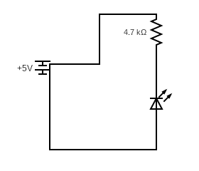
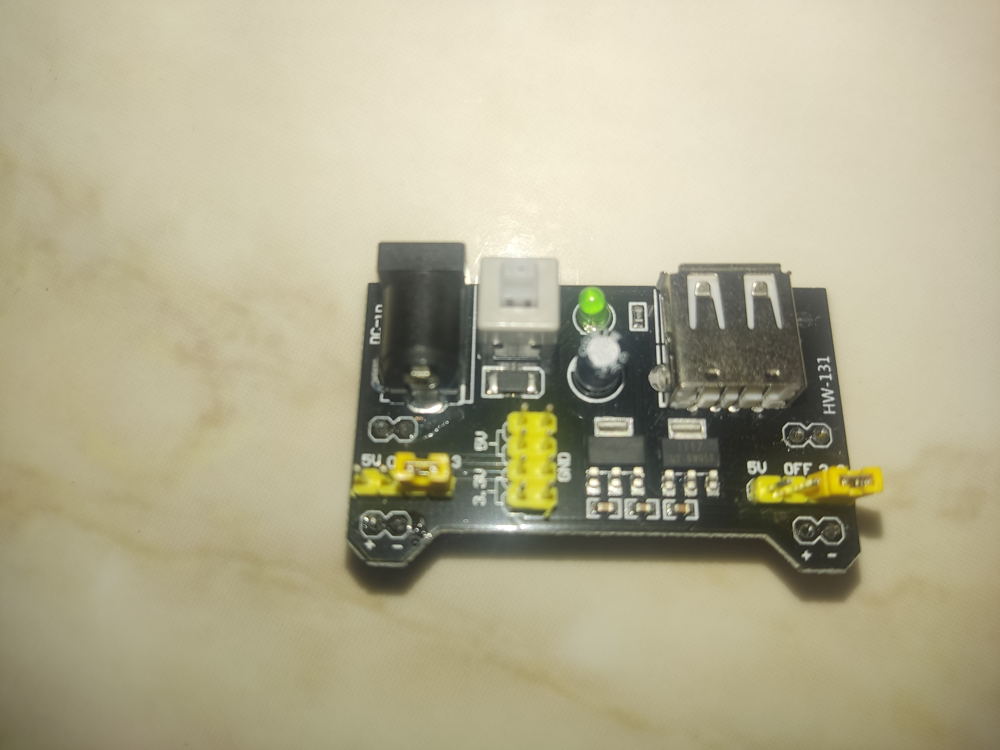
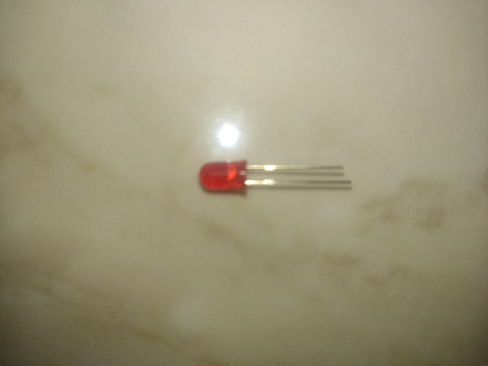
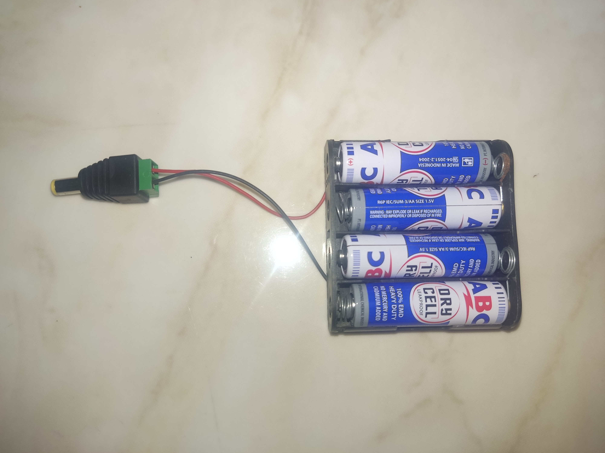

# electronic-project-1-Power-Breadboard
first electronic project 

## about
This is just a basic turning on the led with your powersupply, utilizing with of course your breadboard and arduino.

note: The DC Jack was a bit rare to find (that already connects with the wire and battery input). Luckily, my local electronic shop did a fix, with making it connect (onsight), and the elderly gentlement used a screwdriver (so, without using soldering iron).

## circuit diagram

## materials
- Power Supply Module

  transforms raw electrical input into a stable output
  

- Breadboard

  provides working space, where temporary circuits can be built.

- LED

- Battery Adapter

- Resistor

  controls current flow & drops voltage

- Solderless Jumper Wire

  connects electrical components to breadboard

sources:
- [How to use a breadboard power supply module for DIY learning electronics] (https://youtu.be/1er6XQ-BMp4?si=P9U5fwINMmAEqTqL)
- Where did I buy it from?
    - Kit: [Starter Kit Komponen Elektronik UNO R3 Arduino R3 DIY Dengan Kotak - pack](https://tk.tokopedia.com/ZS5u27ohJ/)
    - DC Jack: [plaza_electro](https://shopee.co.id/plaza_electro)
